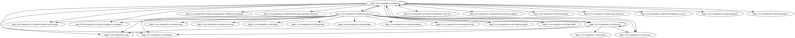

# go-web-crawler

> A Web crawler, sometimes called a spider or spiderbot and often shortened to crawler, is an Internet bot that systematically browses the World Wide Web, typically for the purpose of Web indexing (web spidering). -- [Wikipedia](https://en.wikipedia.org/wiki/Web_crawler)

## Contents

- [Architecture](#architecture)
- [Considerations](#considerations)
- [Code Comments](#code-comments)
- [Code Design](#code-design)
  - [Coordinator](#coordinator)
  - [Requester](#requester)
  - [Crawler](#crawler)
  - [Parser](#parser)
  - [Mapper](#mapper)
  - [Formatter](#formatter)
- [Examples](#examples)
- [Structure](#structure)
- [Improvements](#improvements)
- [TODO](#todo)
- [How long did it take?](#how-long-did-it-take)

## Architecture

<a href="https://raw.githubusercontent.com/Integralist/go-web-crawler/master/architecture.png" target="_blank">
  
</a>

## Considerations

Due to the potential unbounded nature of a web crawler, we want to ensure we don't overwhelm the CPU by creating a large number of goroutines (they still have a cost, especially with regards to the overhead of the scheduler having to context switch). 

To try and avoid that issue we'll limit our concurrency by:

- Defining a bounded worker pool of goroutines.
- Providing tasks for the pool via a buffered channel.

> Note: the worker pool defaults to 20, but will be set dynamically to a smaller number if there's less data to be processed.

## Code Comments

This project was born from a 'take home' job interview code test, and so I've heavily commented the code to explain certain rationale/thought processes. I wouldn't normally have this many comments in my code as I prefer to move complicated logic into separate functions †

> † this is a classic refactoring technique referred to as [Extract Method](https://www.integralist.co.uk/posts/refactoring-techniques/#13), please refer to an old blog post of mine (2013) for more [refactoring techniques](https://www.integralist.co.uk/posts/refactoring-techniques/).

## Code Design

To fulfil the design requirements of this project, we additionally have six components:

- [Coordinator](#coordinator)
- [Requester](#requester)
- [Crawler](#crawler)
- [Parser](#parser)
- [Mapper](#mapper)
- [Formatter](#formatter)

> Note: dear lord having generics in Go would have helped make some of the repetitive tasks easier to design 🤦‍♂️

### Coordinator

The coordinator package acquires the entry page for the given host, and then kick starts the crawling/parsing/mapping stages for each subsequent web page found. It does this by recursively calling an internal process function (meaning pages are processed in concurrent batches).

### Requester

The requester is a simple wrapper around the net/http `Get` function. It accepts a URL to request, and returns a struct consisting of the URL and the response body. It is used by both the [Coordinator](#coordinator) (in order to retrieve the entry page) and the [Crawler](#crawler) (for requesting multiple URLs related to anchors found in each crawled page).

### Crawler

The crawler accepts a list of '[mapped](#mapper)' pages (the coordinator provides a single mapped page in order to kickstart the subsequent crawl), and it will loop over all the found anchors (nested linked URLs `<a href="...">`) for each page and request them using the [Requester](#requester).

The crawler will return its own list of requested pages, wrapped in a struct, to be further processed by the [Parser](#parser) package.

### Parser

Once the crawler has returned a subset of pages, those will be passed over to the parser to tokenize. The parser will then return its own list of tokenized pages, wrapped in a struct, to be further processed by the [Mapper](#mapper) package.

The parser has two exported functions:

- `Parse`: accepts a `requester.Page` and tokenizes it.
- `ParseCollection`: accepts a slice of `requester.Page` and sends each page to `Parse`.

### Mapper

Once the parser has returned a set of tokenized pages, those will be passed over to the mapper to filter out any unwanted content. The mapper will then return its own list of pages, wrapped in a struct (with filtered fields), which are appended to a final `results` slice within the coordinator package, and which is used to display what was crawled.

The mapper has two exported functions:

- `Map`: accepts a `parser.Page` and filters it.
- `MapCollection`: accepts a slice of `parser.Page` and sends each page to `Map`.

### Formatter

The formatter is used when passing the `-dot` flag. It currently offers one exported function `Dot`, which transforms the results data into dot format notation for use with generating a site map graph via [graphviz](https://www.graphviz.org).

The output will be (for `integralist.co.uk`) something like the following (albeit much longer):

```
digraph sitemap {
  "https://www.integralist.co.uk/posts"
    -> {
      "https://www.integralist.co.uk/",
      "https://www.integralist.co.uk/about/",
      "https://www.integralist.co.uk/resume/",
      "https://www.integralist.co.uk/search/",
      "https://www.integralist.co.uk/posts",
      "http://www.integralist.co.uk/posts/algorithmic-complexity-in-python/",
      "http://www.integralist.co.uk/posts/data-types-and-data-structures/",
      "http://www.integralist.co.uk/posts/python-code-design/",
      "http://www.integralist.co.uk/posts/modern-js/",
      "http://www.integralist.co.uk/posts/engineer-to-manager/",
      "http://www.integralist.co.uk/posts/architecture-interview/",
      "http://www.integralist.co.uk/posts/post-mortem-template/",
      "http://www.integralist.co.uk/posts/opsbot/",
      "http://www.integralist.co.uk/posts/go-interfaces/",
      "http://www.integralist.co.uk/posts/multigrain-services/",
      "https://www.integralist.co.uk/posts/page/2/",
      "https://www.integralist.co.uk/posts/page/7/"
    }
  "https://www.integralist.co.uk/search/"
    -> {
      "https://www.integralist.co.uk/",
      "https://www.integralist.co.uk/about/",
      "https://www.integralist.co.uk/resume/",
      "https://www.integralist.co.uk/search/",
      "https://www.integralist.co.uk/posts",
    }
    ...
}
```

You can then either redirect this output to a standalone file (e.g. `example.dot`) or pipe the output direct to the graphviz `dot` command, in order to generate a graph of crawled web pages:

```
dot -Tpng example.dot -o example.png
```

<a href="https://raw.githubusercontent.com/Integralist/go-web-crawler/master/example.png" target="_blank">
  
</a>

> Note: there is a known issue with this approach, which is that a large website with lots of interlinking pages will be impossibly slow to generate an image when using graphviz, simply because the permutations of cross-posting links (my site is one such example, and the above image is a tiny representation of cross linking).

## Examples

To run the program, you can use the provided Makefile for simplicity:

```bash
make run
```

The above command is equivalent to:

```
go run -ldflags "-X main.version=71c00f0" cmd/crawler/main.go -hostname integralist.co.uk -subdomains "www,"
```

> Note: we use the last repository commit for internal app versioning.

The final output from crawling `integralist.co.uk` was (at the time of writing):

```
Number of URLs crawled and processed: 290
Time: 20.310612456s
```

If you want to see json output of the site structure (all crawled pages, and any links/static assets found) then we need to provide the go program with a `-json` flag, which via Make is configured like so:

```
make run json=-json
```

The output will resemble something like the following (albeit much longer):

```
[
  {
    "Anchors": [
      "https://www.integralist.co.uk/",
      "https://www.integralist.co.uk/about/",
      "https://www.integralist.co.uk/resume/",
      "https://www.integralist.co.uk/search/",
      "https://www.integralist.co.uk/posts",
      "https://www.integralist.co.uk/posts/python-code-design/"
    ],
    "Links": [
      "https://www.integralist.co.uk/css/main.d02777fd.css",
      "https://www.integralist.co.uk/css/custom.css",
      "https://www.integralist.co.uk/css/highlight.github.css"
    ],
    "Scripts": [
      "https://www.integralist.co.uk/js/main.af838dd5.js",
      "https://www.integralist.co.uk/js/custom.js",
      "https://www.integralist.co.uk/js/highlight.pack.js",
      "https://www.integralist.co.uk/js/highlight-trigger.js"
    ],
    "URL": "https://www.integralist.co.uk/tags/asyncio"
  }
]
```

The benefit of json output is that we can pipe it to other programs for further processing using other tools available to the calling environment.

For example, the below command will output (with `integralist.co.uk` as the default `-hostname` value) `290` (that's 290 crawled pages):

```
make run json=-json | jq .[].URL | sort | uniq -c | wc -l
```

To crawl a different website, let's say `monzo.com`, we need to provide the go program with a `-hostname` flag, which via Make is configured like so:

```
make run hostname=monzo.com
```

The final output from crawling `monzo.com` was (at the time of writing):

```
Number of URLs crawled and processed: 1053
Time: 11m41.729154506s
```

## Structure

The project follows the guidelines as defined by:

[github.com/golang-standards/project-layout](https://github.com/golang-standards/project-layout)

```
.
├── Makefile
├── cmd
│   └── crawler
│       └── main.go
├── dist
├── go.mod
├── go.sum
└── internal
    ├── coordinator
    │   └── coordinator.go
    ├── crawler
    │   └── crawl.go
    ├── formatter
    │   └── format.go
    ├── mapper
    │   └── map.go
    ├── parser
    │   ├── parse.go
    │   └── parse_unexported.go
    └── requester
        └── http.go
```

## Improvements

Some things that we should consider...

- **Resilience**: HTTP errors (e.g. timeouts) are quietly skipped over but we could utilize a package such as Hashicorp's [go-retryablehttp](https://github.com/hashicorp/go-retryablehttp) which implements logic for handling retries and also exponential backoff.

- **Performance**: profile hot spots, and tweak the 'bounded worker pool' pattern used.

## TODO

- Tests (YOLO - I managed to squeeze in some, but I'll finish this up another time).
  - Might require some code redesign to better support interfaces + dependency injection.
- Ignore URLs based on pattern (e.g. `/tags/...`).
  - In the case of my blog, I don't necessarily care about crawling the tag endpoints.
- Think of different approach to rendering large/complex graph data (either json or dot format).
  - Using graphviz didn't work out once the bidirection edges become large (as they do in my site).
- Investigate golang patterns for configuring variables from outside a package.
  - We can either modify exported package level vars, or use a custom `Init` function, but are there better ways to do this?

## How long did it take?

The initial design plan I had was always to have a Parser and Mapper package, and to just use Wait Groups to control handling the concurrent requesting of pages within the `main` package. That took a few hours to put together and was quite crude in implementation.

After that I implemented the bounded worker pool pattern, and could have just stopped there, but I was enjoying working on the project and so I spent a few more hours (over the coming days) tweaking the design and implementation, extra packages (coordinator & crawler) documentation etc.
